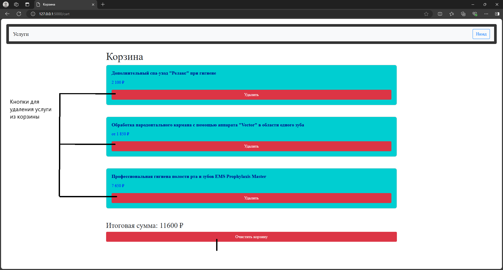

# python-api

## Сервис по скрапингу и калькулятору стоматологических услуг
Этот проект представляет собой сервис, который скрапит сайт [стоматологической клиники](https://стомпрактика.рф) для извлечения информации о стоматологических услугах и ценах, а затем предоставляет пользователю калькулятор для расчета стоимости услуг с возможностью добавления их в корзину, а также имеет функционал сортировки данных услуг.

## Описание проекта
Этот сервис выполняет следующие функции:

### Скрапинг сайта стоматологии
Сайт, с которого мы извлекаем актуальные данные о стоматологических услугах(категории и названия услуг, а также их цены).
### Сортировка услуг
Услуги можно сортировать по возрастанию или убыванию цены для удобства выбора.
### Калькулятор стоматологических услуг
Пользователь может выбрать одну или несколько услуг из списка, и система автоматически рассчитывает общую стоимость.
### Корзина
Добавленные услуги можно разместить в корзине и увидеть итоговую стоимость.

## Как запустить проект

### 1. Клонировать репозиторий
Для начала необходимо клонировать репозиторий на вашу локальную машину:
```bash
    git clone https://github.com/prudick42/python-api
    cd pytnon-api
```
### 2. Сборка
Выполните команду:
```bash
    ./build.sh
```
### 3. Дождитесь запуска
### 4. Перейдите по [ссылке](http://127.0.0.1:5000)
### 5. Чтобы закончить работу - в терминале нажмите Ctrl + C


## Туториал по работе


